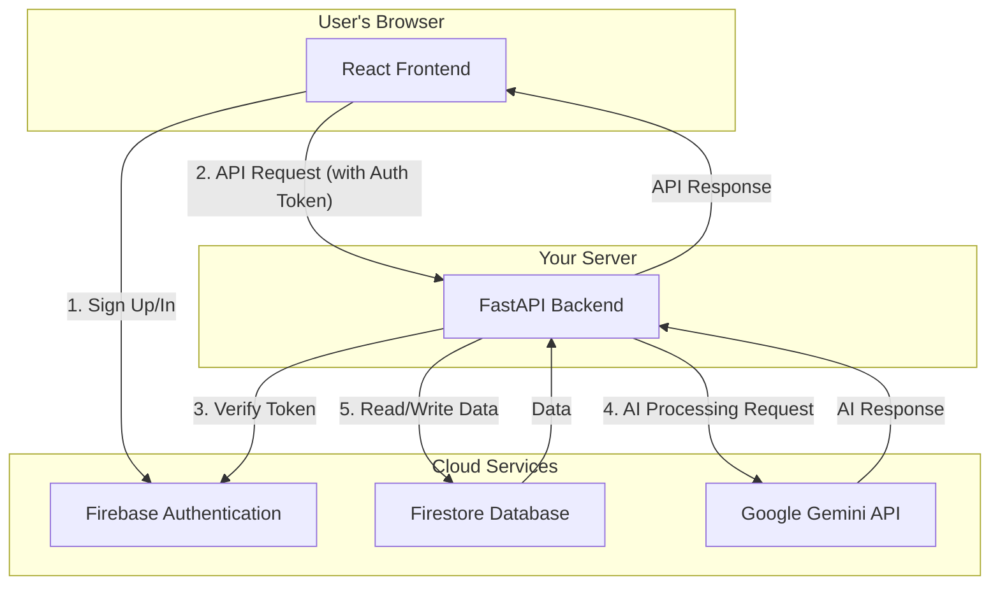

# Disha Guide 🧭

**A Personalized AI Career Architect for Students**

Disha Guide is a modern web application that acts as an intelligent, conversational career mentor. It helps students and young professionals discover their ideal career paths by engaging them in a natural chat, understanding their unique profile, and providing tailored, actionable recommendations.

## ✨ Key Features

- **🤖 Conversational AI Chat:** An interactive chat interface where users can talk to the "Disha Guide" AI mentor to explore their goals and interests.
- **🧠 Automatic Profile Building:** The AI intelligently extracts and structures a user's educational background, skills, and interests from the conversation, building a rich personal profile in the background.
- **🎯 Personalized Recommendations:** Once a user's profile is sufficiently complete, the system generates a list of tailored career recommendations, complete with descriptions and suggested learning pathways.
- **🧭 Career Compass:** A personal dashboard where users can save their favorite career paths and track their progress towards readiness.
- **🛠️ Skill Forge:** An assessment tool that generates on-the-fly quizzes to help users test their proficiency in specific skills relevant to their chosen careers.

---

## 🏗️ How It Works: Architecture & Data Flow

The application follows a standard client-server model. The React frontend is the client that communicates with the FastAPI backend, which in turn orchestrates data storage and AI logic.



1.  **Authentication:** The user signs up or logs in on the React frontend. **Firebase Authentication** handles this process and provides the client with a secure ID token.
2.  **API Requests:** For any action (like sending a chat message), the React frontend sends a request to the **FastAPI backend**, including the Firebase ID token in the headers.
3.  **Token Verification:** The FastAPI backend uses the Firebase Admin SDK to verify the ID token, ensuring the user is authenticated and can only access their own data.
4.  **AI Processing:** The backend sends carefully crafted prompts to the **Google Gemini API** to generate chat replies, extract profile information, or create career recommendations.
5.  **Data Storage:** The backend saves and retrieves all user data—profiles, chat history, and saved career paths—from the **Firestore Database**.

---

## 🛠️ Technology Stack

| Component                | Technology                                                                                             | Purpose                                  |
| ------------------------ | ------------------------------------------------------------------------------------------------------ | ---------------------------------------- |
| **Frontend**             | [React](https://reactjs.org/), [Vite](https://vitejs.dev/), [React Router](https://reactrouter.com/), [Bootstrap](https://react-bootstrap.github.io/) | User Interface & Experience              |
| **Backend**              | [Python](https://www.python.org/), [FastAPI](https://fastapi.tiangolo.com/), [Uvicorn](https://www.uvicorn.org/)                               | API Server & Business Logic              |
| **Platform & Services**  | [Firebase](https://firebase.google.com/), [Google Gemini API](https://ai.google.dev/)                   | Authentication, Database, & AI           |

---

## 🚀 Getting Started

### Prerequisites

- [Node.js](https://nodejs.org/) (v18 or later) and npm
- [Python](https://www.python.org/) (v3.10 or later) and pip
- A **Firebase** project with **Authentication** and **Firestore** enabled.
- A **Google Gemini API** key.

### Installation & Setup

1.  **Clone the repository.**
2.  **Set up the Backend:** Navigate to `disha-backend`, create a virtual environment, and install dependencies from `requirements.txt`.
3.  **Set up the Frontend:** Navigate to `disha-frontend` and run `npm install`.
4.  **Configure Environment Variables:** Create a `.env` file in both the frontend and backend directories by copying the `.env.example` files and filling in your own Firebase and Gemini API keys.

### Running the Application

You will need to run two separate terminals for the backend and frontend.

1.  **Run the Backend Server:**
    ```bash
    cd disha-backend
    source venv/bin/activate
    uvicorn app.main:app --reload
    ```

2.  **Run the Frontend Development Server:**
    ```bash
    cd disha-frontend
    npm run dev
    ```
    You can now access the application at `http://localhost:5173`.
